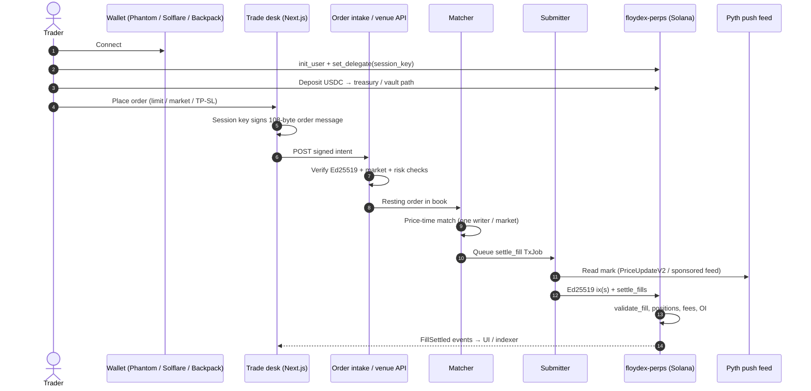
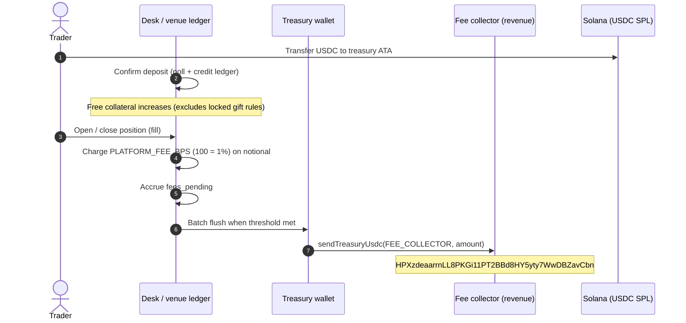
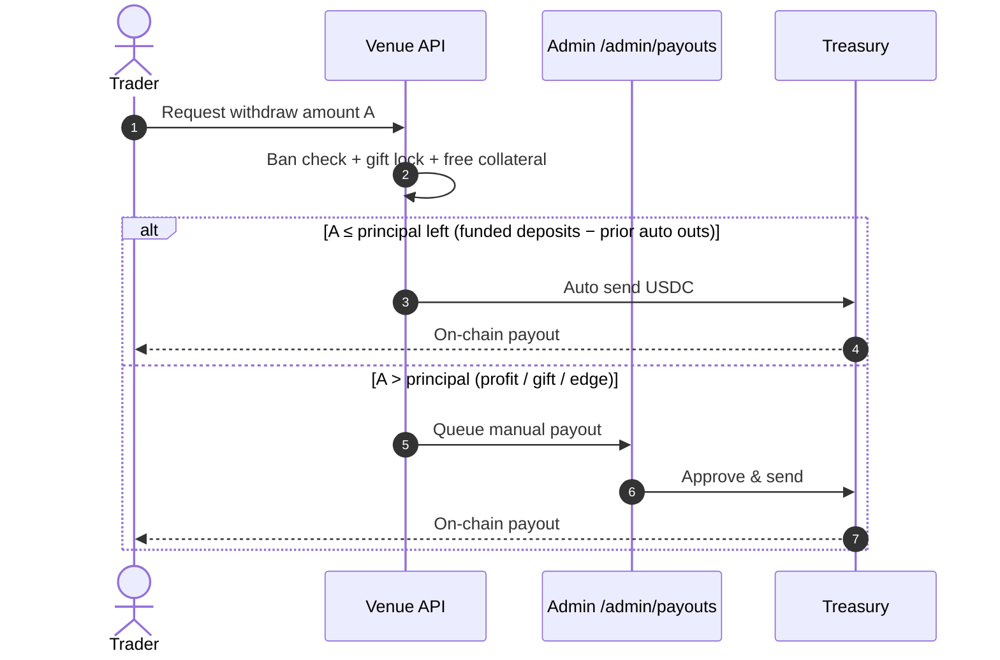
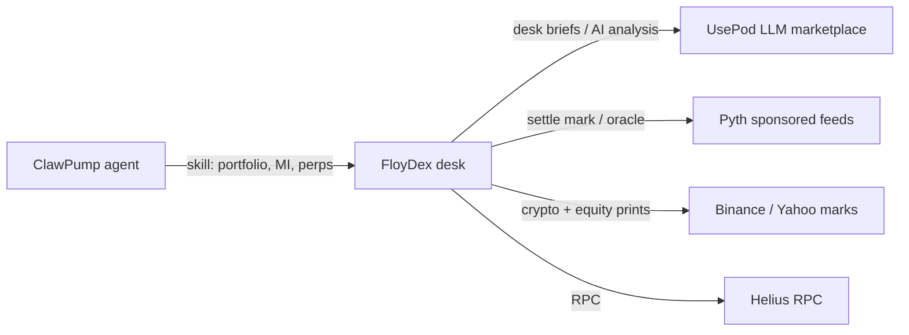
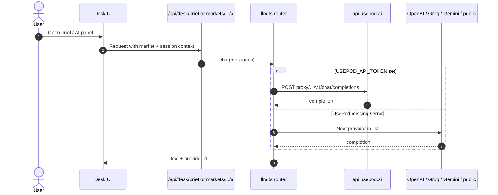
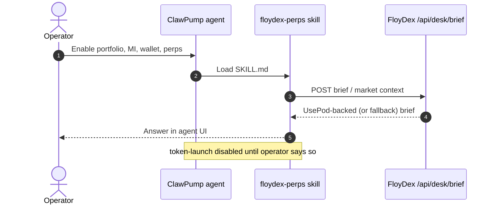
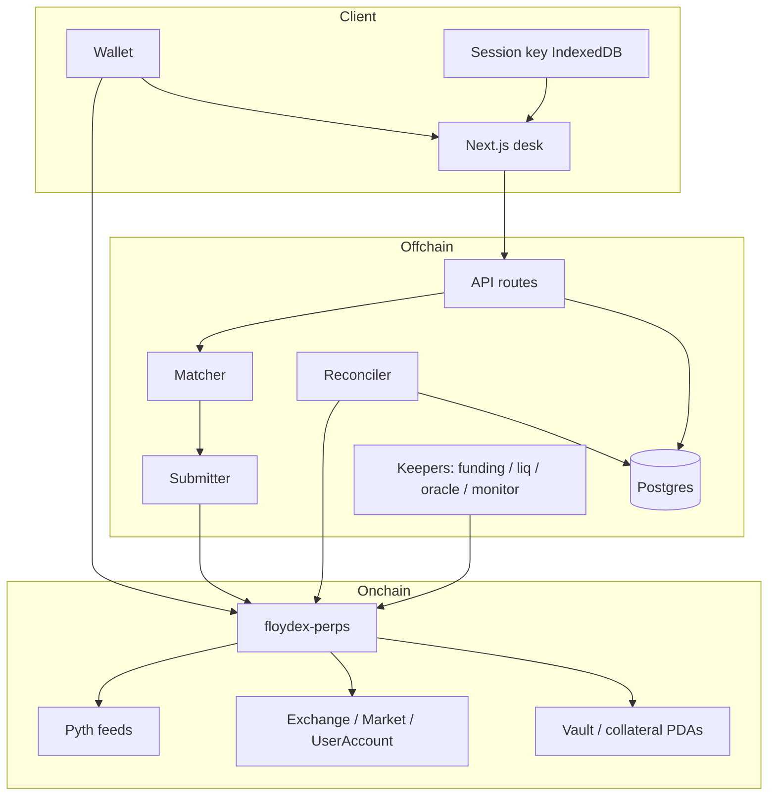

# FloyDex

**Trade US stocks 24/7 on Solana — with your stocks as margin.**

[](https://github.com/FloyDex/FloyDex-Alpha)
[](./LICENSE)
[](https://solana.com)
[](https://floydex.com)
[](https://t.me/floydex_com)
[](https://x.com/floydex_com)

**Website:** [floydex.com](https://floydex.com)  
**Telegram:** [t.me/floydex_com](https://t.me/floydex_com)  
**X:** [@floydex_com](https://x.com/floydex_com)  
**Repo:** [github.com/FloyDex/FloyDex-Alpha](https://github.com/FloyDex/FloyDex-Alpha)

FloyDex is a Solana-native **hybrid CLOB** for tokenized-stock and crypto
perpetuals: off-chain matching, on-chain settlement of user-signed intents,
session-aware risk, and a live trade desk with admin, AI briefs, and partner
integrations.

---

## Table of contents

1. [What this is and who it's for](#what-this-is-and-who-its-for)
2. [Story & inspiration](#story--inspiration)
3. [Problem](#problem)
4. [Solution](#solution)
5. [How it works](#how-it-works)
6. [Target users](#target-users)
7. [Features](#features)
8. [Addresses & revenue](#addresses--revenue)
9. [Sponsor & partner integrations](#sponsor--partner-integrations)
10. [Tech stack](#tech-stack)
11. [Architecture](#architecture)
12. [Competitors](#competitors)
13. [Go to market](#go-to-market)
14. [Business model](#business-model)
15. [Roadmap](#roadmap--future)
16. [Team](#team)
17. [Run locally](#run-locally)
18. [Verify / tests](#verify--tests)
19. [Repo layout](#repo-layout)
20. [Security notes](#security-notes)
21. [License](#license)

---

## What this is and who it's for

**What:** An order-book perpetual futures venue on Solana focused on US equities
and ETFs (TSLA, NVDA, AAPL, SPY, …), plus major crypto perps (BTC, ETH, SOL, …).
Matching is off-chain; every fill settles on-chain against exactly what the
trader signed. The risk engine knows Regular / Extended / Closed / Halted
sessions so weekend rules are public, not tribal knowledge.

**Who it's for**

| Audience | Why they care |
|---|---|
| Crypto-native traders | Leverage on stocks without a broker KYC wall |
| xStocks / tokenized equity holders | Use idle stock tokens as margin; hedge weekends and earnings |
| Market makers | Fast CLOB, signed intents, SDK, known fees |
| Desk operators | Admin for overview, payouts, bans; UsePod AI briefs; ClawPump agent skill |

**Not this product:** We are not a spot DEX and not an issuer of tokenized stocks.
The desk is open globally — there is **no country geofencing**.

---

## Story & inspiration

In 2025–2026, **tokenized stocks found a home on Solana** (xStocks and others:
hundreds of millions in AUM, most global tokenized-equity DEX volume). At the
same time, **stock perps exploded on Hyperliquid** (HIP-3 / trade.xyz), while
most of that leverage still lived *off* Solana.

FloyDex is built Solana-native from day one: a hybrid CLOB with Ed25519
signed intents, off-chain matching, on-chain settlement, and session-aware
risk — so equity perps can run at Solana speed without pretending the cash
market never closes.

The inspiration is simple: **bring leverage to where the stocks already are**,
let those stocks be margin, and publish weekend risk so nobody gets liquidated
by a surprise rule.

> Positioning: *Trade stocks 24/7 on Solana, with your stocks as margin.*

---

## Problem

1. **Split liquidity.** Spot tokenized equities trade on Solana; most equity
   *perps* volume sits on other chains or CEXes.
2. **USDC-only venues ignore the asset.** Holders of TSLAx / NVDAx cannot
   post those tokens as margin against the same underlying.
3. **Closed markets are mishandled.** Competitors either halt or pretend price
   is continuous — weekend liquidations and opaque marks.
4. **Wallet UX kills maker flow.** Per-order wallet popups are too slow for a
   real book; fully on-chain books burn gas on every cancel.
5. **Operators need a desk, not just a program.** Deposits, gifts, manual
   payouts, bans, and AI market context have to work day one.

---

## Solution

| Pillar | What we ship |
|---|---|
| Hybrid CLOB | Off-chain price-time matching; on-chain `settle_fills` with full `validate_fill` |
| Session keys | One `set_delegate`; then popup-free signed intents; withdrawals always need the owner |
| Session-aware risk | Regular / Extended / Closed / Halted in `crates/risk-engine` — enforced on-chain |
| Stock as margin | Path to xStocks collateral + portfolio margin (phase 2); USDC settlement today |
| Live desk | Next.js terminal, venue ledger, admin, signup gift, stake surface, AI analysis |
| Partners | UsePod (desk LLM), ClawPump (agent skill), Pyth (oracle), Binance/Yahoo (marks) |

---

## How it works

### Trust model

Nothing the operator does can move user funds beyond what the user signed.
Deposits and withdrawals always require the main wallet. Orders are Ed25519
intents checked on-chain via the native Ed25519 program + instruction
introspection (`docs/prd/05` §5).

### End-to-end trade (happy path)



### Deposit → trade fee → revenue collector



### Withdrawal (auto vs manual)



---

## Target users

See also `docs/prd/01-product-prd.md` §3.

- **Crypto-native levered traders** — NVDA/TSLA/SPY around the clock in USDC.
- **Tokenized equity holders** — post xStocks as margin; basis / funding products later.
- **Market makers** — API + SDK, maker-friendly fee path, no per-order gas.
- **Operators / admins** — desk overview, trader table, bans, payout queue.
- **Agent platforms** — ClawPump skill for portfolio / market intelligence / perps
  (tokenize only when the operator explicitly says so).

---

## Features

### Markets (desk)

Equities / ETFs: TSLA, NVDA, AAPL, SPY, META, AMZN, QQQ, MSFT, COIN, MSTR  
Crypto: SOL, BTC, ETH, XLM, XRP, ADA, BNB, TRX (and related perps in config)

Marks: Yahoo (equities, incl. extended hours) and Binance (crypto / listed RWA).
Charts: TradingView symbols where configured.

### Trading

- Limit, market (IOC walk), reduce-only, TP/SL-style triggers
- Cross margin (isolated deferred until vault ledger is ready)
- Order book, trades tape, positions, open orders, funding history
- Liquidation map, market info, AI analysis panel, desk tour
- Signup gift: **$5** credit, unlocks after **$500** realized profit
  (anti-abuse by wallet / IP / device)

### Risk & settlement (program path)

- Pyth-guarded marks; session calendar; closed-mark EMA
- Funding, partial liquidation, insurance staking, ADL last resort
- Platform fee **1%** (`PLATFORM_FEE_BPS = 100`) on fills, flushed to fee collector

### Operator surfaces

- `/admin` — overview (volume, fees, treasury), traders, payouts, bans
- Stake page (insurance / desk stake UX)
- Leaderboard, portfolio, markets list

---

## Addresses & revenue

Public keys only. **Never commit** private keys, wallet JSON, or `.env`.

### Mainnet / desk (current product config)

| Role | Address | Notes |
|---|---|---|
| **Revenue / fee collector** | `HPXzdeaarrnLL8PKGi11PT2BBd8HY5yty7WwDBZavCbn` | `FEE_COLLECTOR` in `client/config/index.ts`. All platform fill fees flush here as USDC. |
| **Treasury / operator** | `41jft3o6Q7HBFw1UPJqh2jsLDz12zaRa6WuRFG9iJDhj` | `NEXT_PUBLIC_TREASURY` / deposit destination & withdraw source for the venue ledger |
| **Program** | `2vgBHV763RtsBZGNpnuvbkGDKJdtt1DxP9tUDo4NZxUB` | `floydex-perps` (also used on the documented devnet gate) |
| **USDC mint (mainnet)** | `EPjFWdd5AufqSSqeM2qN1xzybapC8G4wEGGkZwyTDt1v` | Settlement asset |

**Fee:** `PLATFORM_FEE_BPS = 100` → **1.00%** of notional per fill (charged in the
venue ledger and sent on-chain to the fee collector when the pending batch
clears).

Explorer links (mainnet):

- [Fee collector](https://explorer.solana.com/address/HPXzdeaarrnLL8PKGi11PT2BBd8HY5yty7WwDBZavCbn)
- [Treasury](https://explorer.solana.com/address/41jft3o6Q7HBFw1UPJqh2jsLDz12zaRa6WuRFG9iJDhj)
- [Program](https://explorer.solana.com/address/2vgBHV763RtsBZGNpnuvbkGDKJdtt1DxP9tUDo4NZxUB)

### Devnet gate (`deployments/devnet.json`)

| Account | Address |
|---|---|
| Program | `2vgBHV763RtsBZGNpnuvbkGDKJdtt1DxP9tUDo4NZxUB` |
| Exchange PDA | `LnVD1MrMvPohtamKtrrCNH6kG992HM5grFJiA6KqnkQ` |
| Market PDA | `2kWD1pj7XLMXankFeb2LRNoyKvx2NhgLGgNwVTpAuR1q` |
| Vault | `8byGMd73tNV87Eam96zjvduMsmW4Q7CxupPusz8kaLCY` |
| Insurance | `4wkbjVmv9wcUJTfikTgAQTdbT9R29zExuwqpN37FiKng` |
| Settlement collateral | `49RBddCmqk7dpb2Fu6exWA5mgbjk9soeyXZYEwtDzzGR` |
| Devnet USDC mint | `BL4DqDDg5uerF11E4PafA43Vj7MVfy25xy9wwyXeMCqd` |
| Operator | `CbhFXNFcaEbrwftTZ6aG1YBkCLKNsmxqNjhdXxzbco15` |
| Guardian | `6dyRqaMdJQvWfsydYhEfWMWsuCghkaL4uFBgK6Yp3bG9` |
| Calendar authority | `66hXQNkGVyZDoyjbxMuKXxTZiMNWeKygAASsBpAufwJP` |
| SOL/USD Pyth push (shard-0) | `7UVimffxr9ow1uXYxsr4LHAcV58mLzhmwaeKvJ1pjLiE` |

---

## Sponsor & partner integrations

FloyDex wires external partners for **inference, agent distribution, oracle
prices, and reference marks** — not for custody of user funds.

### Overview



### UsePod (desk AI)

- **Role:** Primary LLM route for desk briefs (`/api/desk/brief`) and market AI
  (`client/lib/market/llm.ts`).
- **Config:** `USEPOD_API_TOKEN` (server-only). Optional fallbacks: OpenAI,
  Groq, Gemini, then a public OpenAI-compatible endpoint.
- **Docs:** [usepod.ai quickstart](https://docs.usepod.ai/using/quickstart/)



### ClawPump (agent skill — no token launch by default)

- **Role:** Host the FloyDex agent skill so portfolio, market-intelligence,
  wallet, and perps tools can call the desk (`skills/floydex-perps/`).
- **Config:** `CLAWPUMP_API_KEY` (server-only) when calling ClawPump APIs.
- **Hard rule:** Do **not** enable `token-launch` or run `npx clawpump launch`
  unless the operator explicitly asks to tokenize later.



### Pyth (sponsored oracle)

- Free **sponsored shard-0** push feeds on Solana for program settlement /
  liquidations (see `docs/prd/06`, roadmap Phase 2 gate).
- Devnet gate settled a fill against the sponsored SOL/USD feed above.

### Binance & Yahoo (reference marks for the desk)

- Crypto perps: Binance spot / futures tickers, funding, OI, trades.
- Equities: Yahoo Finance live / extended-hours prints; Binance RWA when listed.
- Optional `BINANCE_API_KEY` / `BINANCE_API_SECRET` for authenticated Web3 /
  RWA paths — **server-only, never commit**.

### Helius (RPC)

- Preferred RPC for deploy / settle under load (`RPC_URL` in root `.env`).
- Public Solana RPCs work for light local UI work.

---

## Tech stack

| Layer | Choice |
|---|---|
| Chain | Solana (Agave 2.1.x tooling), Anchor **0.31.1** |
| Program | `programs/floydex-perps` — single Anchor program |
| Risk / math | `crates/protocol-core`, `crates/risk-engine` — pure `no_std` Rust |
| Oracle | Pyth `PriceUpdateV2` / push feeds |
| Off-chain services | TypeScript (Node ≥ 22), Postgres + Prisma |
| Matcher stack | `services/order-intake`, `matcher`, `submitter`, `reconciler`, `kit`, `db` |
| Desk | Next.js 16, React 19, Tailwind, TanStack Query, Solana wallet adapters |
| SDK | `sdk/` — order encoding + Ed25519 helpers + golden vectors |
| Infra (typical) | Helius RPC, Docker Compose for Postgres, pm2 / Railway / Cloudflare optional |

Pinned build note: host toolchain **Rust 1.96.1** for `yarn build` (Anchor IDL);
SBF stays 1.79-compatible (`ethnum 1.5.2`, etc.). See `CLAUDE.md`.

---

## Architecture

### System shape



### Program ↔ crates

```
Trader intents (108-byte order)     UI / SDK (TS)
        │                                 │
        ▼                                 ▼
 services/*  ── settle_fills ──►  programs/floydex-perps
                                        │
                    converts accounts ──┤
                                        ▼
                         crates/protocol-core  (fixed-point, order, oracle guard)
                         crates/risk-engine    (margin, funding, session, liq plan)
```

Design docs: `docs/prd/03-architecture.md`, `05-program-design-anchor.md`,
`07-session-risk-equities.md`.

---

## Competitors

Snapshot from `docs/prd/02` (recheck before any pitch — numbers move weekly).

| Venue | Chain | Model | Equities angle |
|---|---|---|---|
| trade.xyz (HIP-3) | Hyperliquid | CLOB | Category leader for stock perps OI |
| Jupiter Perps (GUM) | Solana | CLOB + legacy pool | Direct Solana threat; equity names expanding |
| Solayer Margin Trade | Solana | On-chain | Synthetic index / commodities |
| Drift / Zeta / Flash | Solana | Hybrid / CLOB / pool | Mostly crypto |
| Ostium / edgeX | Other | Pool / CLOB | RWA / tokenized stocks |

**FloyDex differentiation (hard to copy fast):**

1. Tokenized stocks as margin (+ portfolio margin / basis vault later)
2. Session-aware risk published and enforced on-chain
3. Popup-free session-key trading with audited-style settlement bounds
4. Maker-first API / SDK
5. Pre-listing / event markets (phase 3)

---

## Go to market

1. **Mainnet beta desk** — USDC margin, core equity + crypto list, deposit caps.
   Open worldwide (no country geoblock).
2. **Points, not token first** — volume, tight maker quotes, weekend OI,
   xStocks deposits (see `docs/prd/08`).
3. **MM program** — designated makers for closed-hours books; rebates.
4. **Distribution** — ClawPump agent skill, Solana wallet ecosystems,
   xStocks holder campaigns (“hold + short = earn funding” once basis vault ships).
5. **Trust** — two independent audits before uncapped deposits; bug bounty;
   public addresses and fee collector transparency (this README).

Success targets (first 90 days post mainnet, from PRD): ~$250M cumulative
volume, ~1,500 daily active traders (see `01` §7).

---

## Business model

| Stream | Mechanism |
|---|---|
| **Trading fees** | 1% platform fee on fills → `FEE_COLLECTOR` USDC wallet |
| **Maker rebates / tiers** | Fee config on exchange (program path); token fee tiers later |
| **Insurance / stake** | Stakers backstop; share of risk premium over time |
| **Future protocol token** | Buyback / fee discounts / listing governance — **after** traction gates (`08`) |

No revenue-share promises in marketing until counsel signs off. Primary cash
flow today is the **1% desk fee** flushed to the revenue collector address
above.

---

## Roadmap / future

Full checklist: `docs/prd/09-roadmap.md`.

| Phase | Focus | Status (high level) |
|---|---|---|
| 0 | Crates, Anchor program scaffold, tooling | Done |
| 1 | Accounts, deposit/withdraw, settle_fills, e2e | Done (local e2e in CI) |
| 2 | Session, funding, liq, insurance, xStocks haircuts, fuzz, weekend backtest, **devnet gate** | Done |
| 3 | Order intake, matcher, submitter, reconciler, kit/db | Largely done |
| Next | Indexer polish, production MM liquidity, audits, deposit caps, points | In progress |
| Later | Portfolio margin, Basis Vault, pre-listing markets, protocol token TGE | Planned |

**Explicit non-goals (v1):** spot venue, issuing our own stock tokens,
cross-chain deploy.

---

## Team

| | |
|---|---|
| **Org** | [FloyDex](https://github.com/FloyDex) |
| **Website** | [floydex.com](https://floydex.com) |
| **Telegram** | [t.me/floydex_com](https://t.me/floydex_com) |
| **X** | [@floydex_com](https://x.com/floydex_com) |
| **Repo** | [FloyDex/FloyDex-Alpha](https://github.com/FloyDex/FloyDex-Alpha) |

### Co-founders

**[Amaan Sayyad](https://x.com/amaanbiz)** — Co-founder · blockchain developer · entrepreneur  
45× hackathon wins · 10+ shipped Web3 products · 3× founder · 8× companies · 12× speaker · 3× grantee · research papers, copyrights & patents  

| | |
|---|---|
| X | [@amaanbiz](https://x.com/amaanbiz) |
| GitHub | [AmaanSayyad](https://github.com/AmaanSayyad) |
| LinkedIn | [amaan-sayyad-](https://www.linkedin.com/in/amaan-sayyad-/) |
| Portfolio | [amaan-sayyad-portfolio.vercel.app](https://amaan-sayyad-portfolio.vercel.app/) |
| Proof of work | [Achievements / POW](https://docs.google.com/document/d/1WQXjpoRdcEHiq3BiVaAT3jXeBmI9eFvKelK9EWdWOQA/edit?usp=sharing) |

**[Samya Biswas](https://x.com/CancelSamya)** — Co-founder · blockchain developer  
9× hackathon wins  

| | |
|---|---|
| X | [@CancelSamya](https://x.com/CancelSamya) |
| GitHub | [SamyaDeb](https://github.com/SamyaDeb) |
| LinkedIn | [samyadeb](https://www.linkedin.com/in/samyadeb/) |
| Portfolio | [samyadeb.vercel.app](https://samyadeb.vercel.app/) |

### Contract helpers

| Name | Role |
|---|---|
| Abdulmajid Hassan | Community |
| Konan | Design |
| VR | Graphics |
| Draheem | Motion |

For security reports, contact the co-founders privately — do not open issues that include exploit PoCs against live funds.


---

## Run locally

### Prerequisites

- Node **≥ 22.18**, Yarn 1.22
- Rust + **anchor-cli 0.31.1**, **solana-cli 2.1.0** (for program builds)
- Optional: Docker (Postgres for full matcher stack)

### 1. Clone

```bash
git clone https://github.com/FloyDex/FloyDex-Alpha.git
cd FloyDex-Alpha
```

### 2. Env

```bash
cp client/.env.example .env
# Edit repo-root .env — never commit it.
```

Minimum for the desk UI:

```bash
NEXT_PUBLIC_SOLANA_NETWORK=mainnet   # or testnet (= Solana devnet)
NEXT_PUBLIC_PROGRAM_ID=2vgBHV763RtsBZGNpnuvbkGDKJdtt1DxP9tUDo4NZxUB
NEXT_PUBLIC_TREASURY=41jft3o6Q7HBFw1UPJqh2jsLDz12zaRa6WuRFG9iJDhj
NEXT_PUBLIC_ASSET_USDC=EPjFWdd5AufqSSqeM2qN1xzybapC8G4wEGGkZwyTDt1v
RPC_URL=https://api.mainnet-beta.solana.com   # or Helius
```

Optional partners (server-only):

```bash
USEPOD_API_TOKEN=
CLAWPUMP_API_KEY=
BINANCE_API_KEY=
BINANCE_API_SECRET=
ADMIN_PASSWORD=          # /admin — ≥24 chars, upper+lower+digit
```

### 3. Trade desk

```bash
cd client
npm install
npm run dev
# → http://localhost:3000
# Admin → http://localhost:3000/admin/login
```

### 4. Program + crates (optional)

```bash
# from repo root
cargo test
cargo clippy --all-targets
yarn build              # RUSTUP_TOOLCHAIN=1.96.1 anchor build
yarn test:program       # LiteSVM integration/
yarn e2e 200            # local validator gate (needs keys under gitignored .e2e/)
```

### 5. Off-chain services (optional)

```bash
cd services/db && docker compose up -d   # local Postgres
# then from client/, with DATABASE_URL set:
npm run dev:matcher
npm run dev:reconciler
# see client/package.json for oracle / liquidator / monitor scripts
```

---

## Verify / tests

```bash
cargo test
cargo clippy --all-targets
yarn test:sdk
yarn test:program
cd client && npm test
```

Golden order vectors: `sdk/conformance/order-v1.json` (generated by
`sdk/conformance/generate.py`).

---

## Repo layout

| Path | What it is |
|---|---|
| `programs/floydex-perps/` | Anchor program |
| `crates/protocol-core/` | Fixed-point math, order types, oracle guard (`no_std`) |
| `crates/risk-engine/` | Margin, funding, liquidation plan, **session** risk |
| `client/` | Next.js trade desk + venue APIs + admin |
| `services/` | kit, db, order-intake, matcher, submitter, reconciler |
| `sdk/` | TS SDK + conformance |
| `integration/` | LiteSVM program tests |
| `deployments/` | Devnet gate artifacts |
| `docs/prd/` | Product, architecture, risk, token, roadmap |
| `skills/floydex-perps/` | ClawPump / agent skill docs |

---

## Security notes

- Never commit `.env`, keypairs, or wallet JSON.
- Ed25519 introspection: every offset's instruction index must be `u16::MAX`;
  compare full pubkey and message bytes (`05` §5).
- Do not relax `validate_fill` checks.
- Admin routes are password-gated; operator wallet bans (not country blocks)
  can block deposit / withdraw / trade / gift / stake.

---

## License

**MIT** — see [LICENSE](./LICENSE).

Copyright (c) 2026 FloyDex.

---

## Further reading

1. [`docs/prd/01-product-prd.md`](./docs/prd/01-product-prd.md) — what and why  
2. [`docs/prd/02-market-and-differentiation.md`](./docs/prd/02-market-and-differentiation.md) — competitors  
3. [`docs/prd/03-architecture.md`](./docs/prd/03-architecture.md) — system shape  
4. [`docs/prd/05-program-design-anchor.md`](./docs/prd/05-program-design-anchor.md) — accounts & settlement  
5. [`docs/prd/06-oracle-pyth.md`](./docs/prd/06-oracle-pyth.md) — Pyth  
6. [`docs/prd/07-session-risk-equities.md`](./docs/prd/07-session-risk-equities.md) — sessions  
7. [`docs/prd/08-token-and-launch.md`](./docs/prd/08-token-and-launch.md) — points / token (ticker TBD)  
8. [`docs/prd/09-roadmap.md`](./docs/prd/09-roadmap.md) — phased build  
9. [`CLAUDE.md`](./CLAUDE.md) — agent / contributor hard rules  
